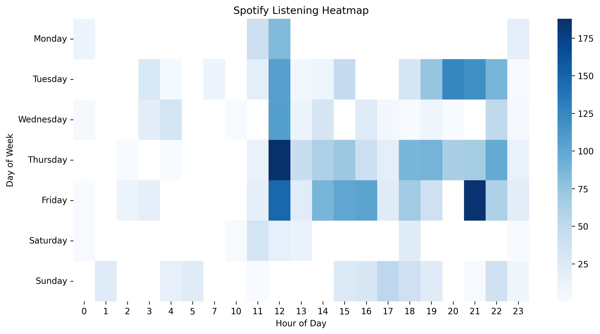
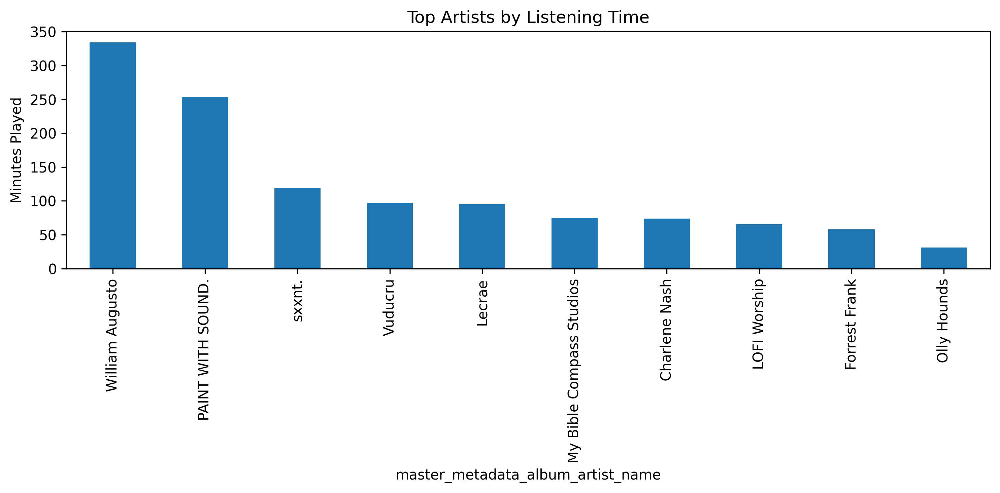
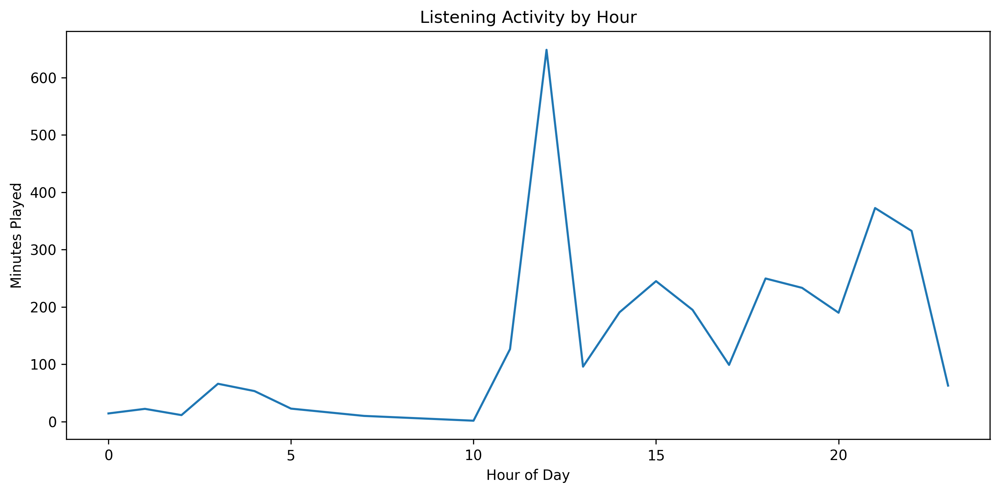
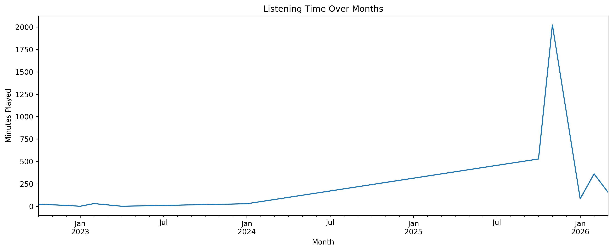
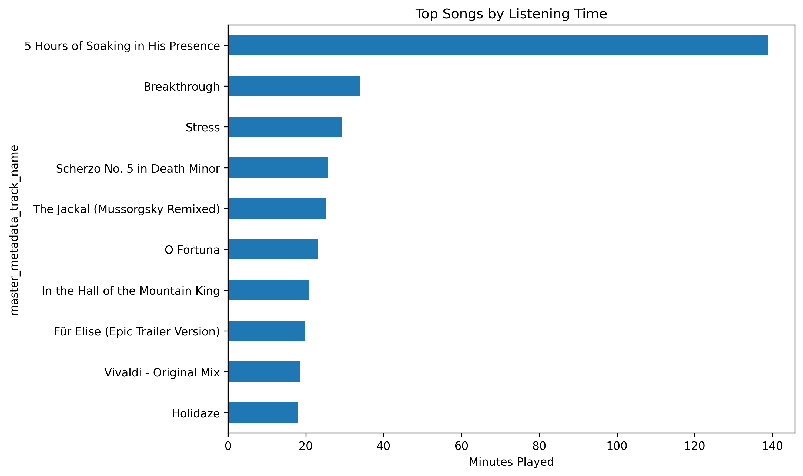

# Spotify Listening Data Analysis

Exploratory analysis of personal Spotify streaming history using **Python and Jupyter Notebook** to understand listening habits, trends, and artist preferences.

This project analyzes exported Spotify streaming data to identify patterns in listening behavior across time, artists, and content types.

---

## Project Highlights

- Listening heatmap by **day of week and hour**
- Top artists and songs by listening time
- Listening activity patterns throughout the day
- Monthly listening trends over time
- Comparison of **music vs podcast consumption**

---

## Tools Used

- Python
- pandas
- Matplotlib
- Seaborn
- Jupyter Notebook

---

## Visualizations

### Listening Activity Heatmap

### Top Artists by Listening Time

### Listening Activity by Hour

### Monthly Listening Trend

### Top Songs by Listening Time

---

## Notebook

You can view the full analysis notebook here:

**Notebook Preview**

https://nbviewer.org/github/walkrrr/spotify-listening-analysis/blob/main/spotify_cleaned.ipynb

---

## Dataset

The dataset consists of personal Spotify streaming history exported from Spotify and includes:

- track name
- artist
- playback duration
- timestamps
- listening platform
- podcast episode information

---

## Purpose

The goal of this project is to practice **data analysis and visualization techniques** using real-world behavioral data while building a portfolio project demonstrating:

- data cleaning
- exploratory data analysis
- visualization
- storytelling with data
